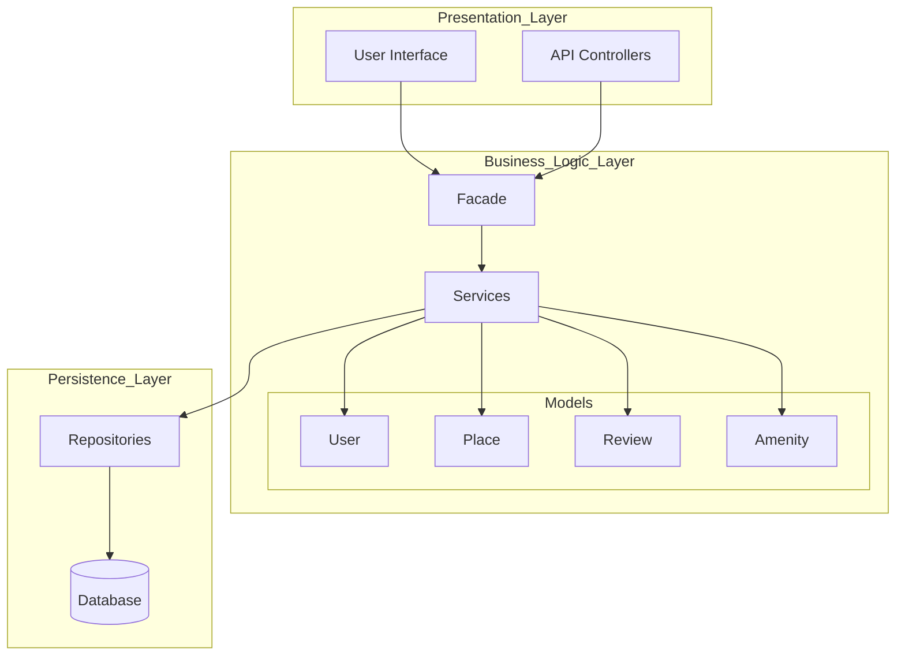
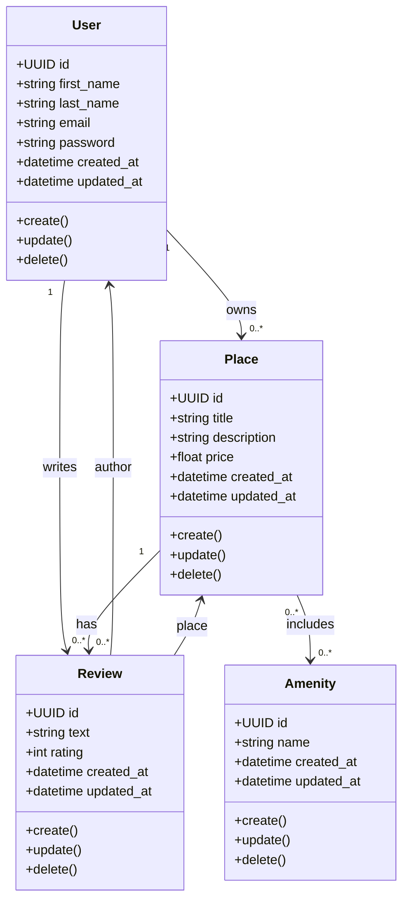
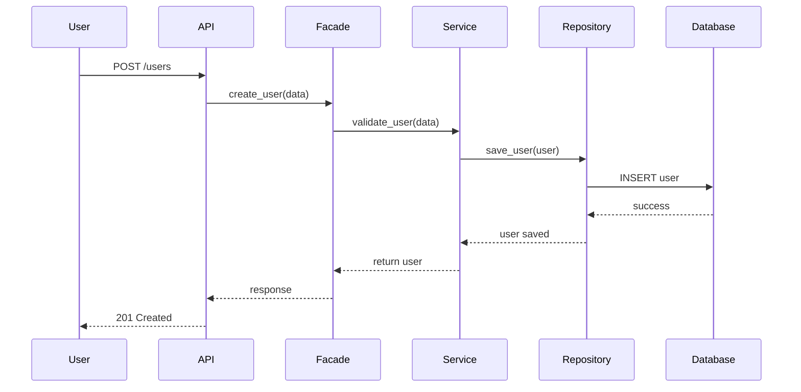
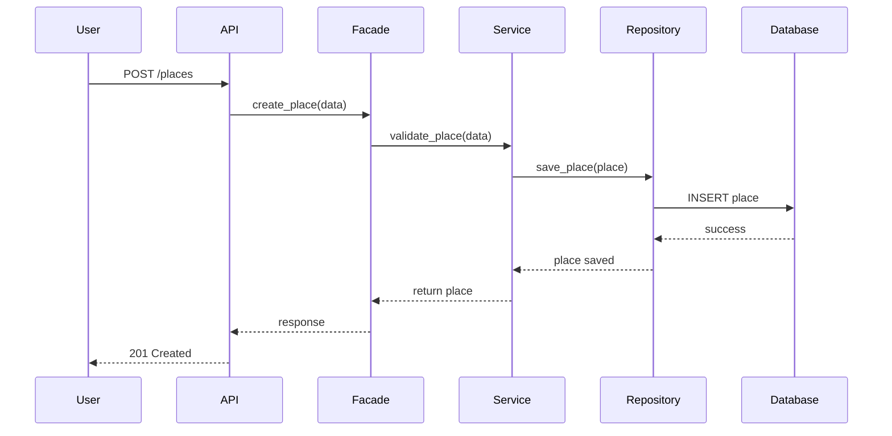
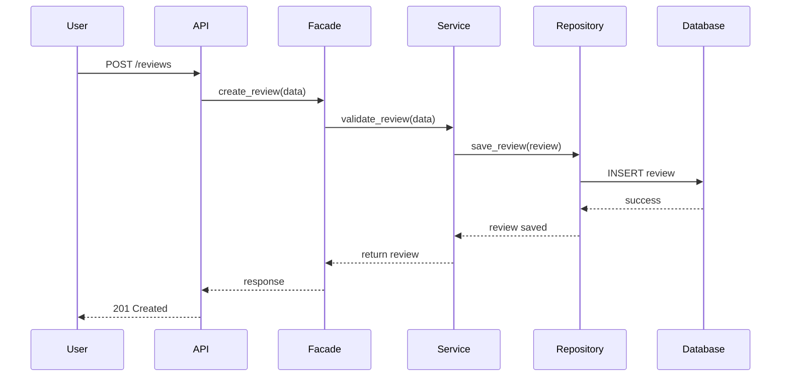
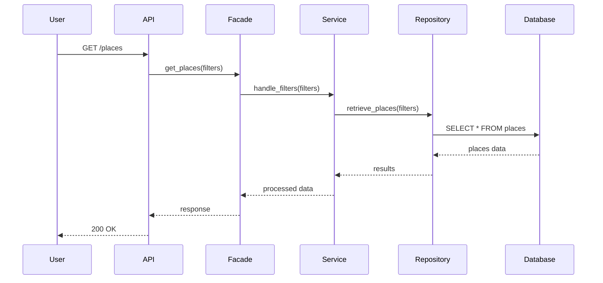

# HBnB Technical Documentation

## 1. Introduction

This document provides a detailed technical overview of the HBnB application architecture and design. It explains the system structure, business logic, and interaction flows.

The document includes:
- High-Level Architecture (Package Diagram)
- Business Logic Layer (Class Diagram)
- API Interaction Flow (Sequence Diagrams)

The goal is to ensure the system is clear, scalable, and maintainable.

---

## 2. High-Level Architecture

### Package Diagram

### Explanation

The system follows a three-layer architecture:

- **Presentation Layer**
  - Handles user interaction (UI and API)
  - Sends requests to the backend

- **Business Logic Layer**
  - Contains core application logic
  - Includes services, models, and a facade

- **Persistence Layer**
  - Manages data storage
  - Uses repositories to communicate with the database

### Facade Pattern

The Facade acts as a single entry point to the Business Logic Layer and simplifies communication between components.

---

## 3. Business Logic Layer

### Class Diagram

### Explanation

#### Entities

- **User**: Application users  
- **Place**: Property listings  
- **Review**: Feedback on places  
- **Amenity**: Features like Wi-Fi or parking  

#### Design

- Each entity has a UUID and timestamps  
- CRUD operations are defined  

#### Relationships

- A User can own multiple Places  
- A User can write multiple Reviews  
- A Place can have multiple Reviews  
- A Place can have multiple Amenities  
- A Review belongs to a User and a Place  

---

## 4. API Interaction Flow

### 4.1 User Registration

---

### 4.2 Place Creation

---

### 4.3 Review Submission

---

### 4.4 Fetch Places

---

## 5. Conclusion

This document describes the architecture and design of the HBnB system.

It ensures:
- Clear separation of concerns  
- Scalability  
- Maintainability  

It can be used as a reference for development and future improvements.
